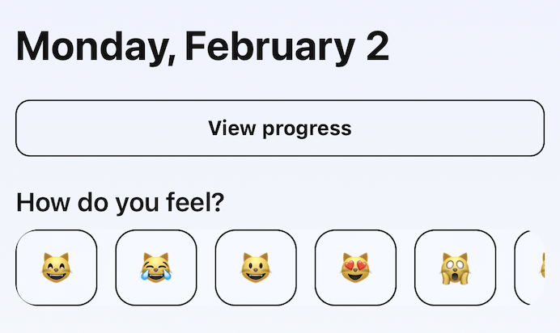
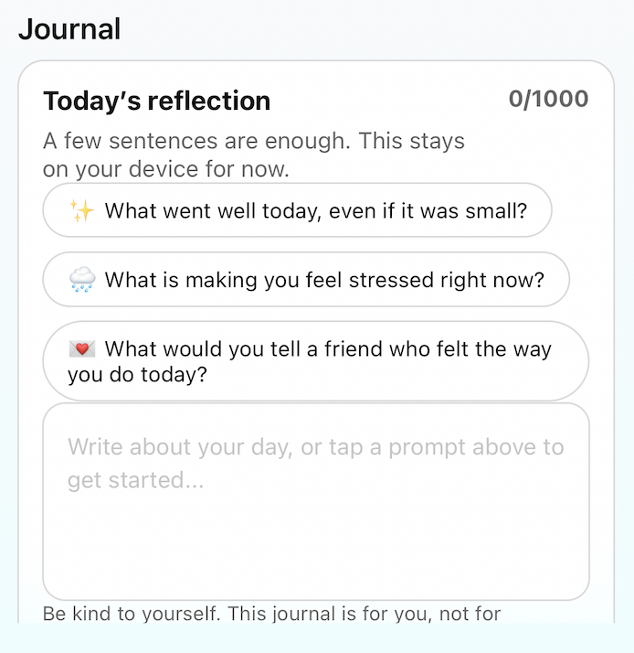
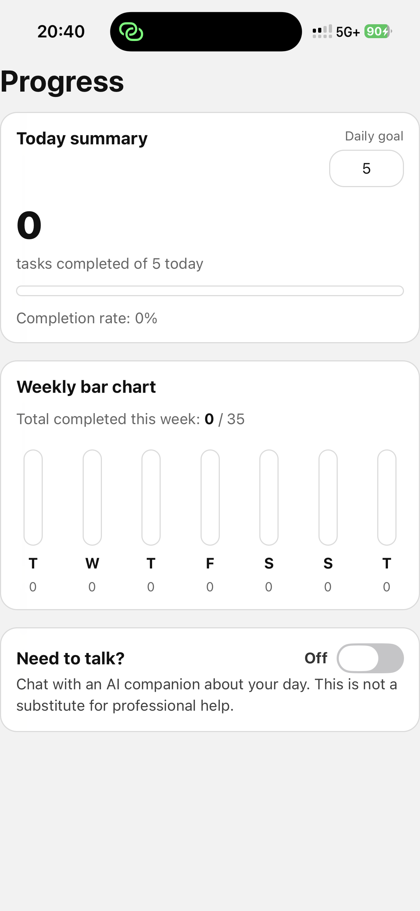
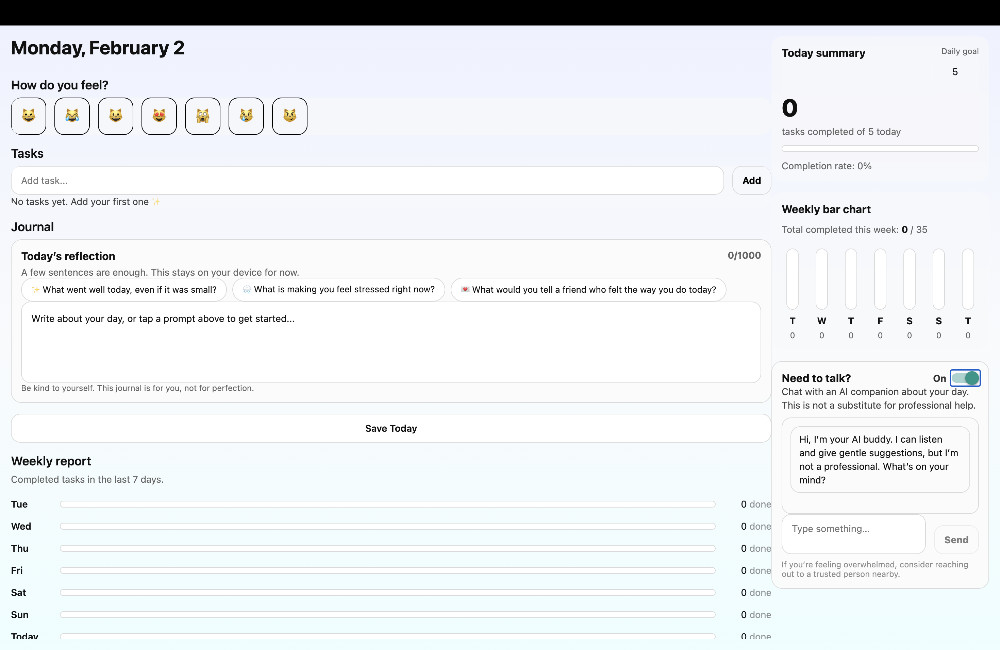

# 🌤️ Mood App — A Personal Mood Journal & Reflection Companion  

A React Native mobile app that helps users track their mood, reflect on their emotions, and stay organized with built-in journaling and to-do features.

---

## 📌 Overview  

Mood App is a lightweight and intuitive mobile application designed to support emotional awareness and daily self-reflection. The app allows users to:  

- Log their mood using an interactive emoji-based scale  
- Write short journal reflections about their day  
- Create and manage a personal to-do list  
- View past mood records and reflections over time  
- Store data securely in a backend database  

The project follows a full-stack architecture with a **React Native (Expo) frontend** and an **Express + MySQL backend**, emphasizing clean UI design, usability, and reliable data persistence.

---

## ✨ Features  

### 😊 Mood Tracking  
Select your mood from a simple, visual scale and add optional notes to capture your feelings in context.



### 📝 Journal  
Write and save short reflections about your day. Entries are timestamped and stored securely.




### ✅ To-Do List  
Create, complete, and delete tasks to help you stay organized alongside your emotional check-ins.




### 📊 Web Page



---

## 🛠️ Tech Stack  

### Frontend  
- React Native (Expo)  
- React Navigation  
- AsyncStorage (local caching)  

### Backend  
- Node.js + Express  
- MySQL  
- RESTful API architecture  

---

## 🚀 Getting Started  

### 1. Install dependencies  

```bash
npm install
```

### 2. Start the app  

```bash
npx expo start
```

You can open the app using:  
- Expo Go (recommended for quick testing)  
- iOS Simulator  
- Android Emulator  
- Development build  


---

## 🔮 Future Improvements  

- Calendar view for mood tracking  
- Data visualization (charts of mood trends)  
- Cloud sync & user authentication  
- Push notifications for daily check-ins  

---

## 👩‍💻 Author  

Zhichen (Annie) Zhang  
UBC Statistics 